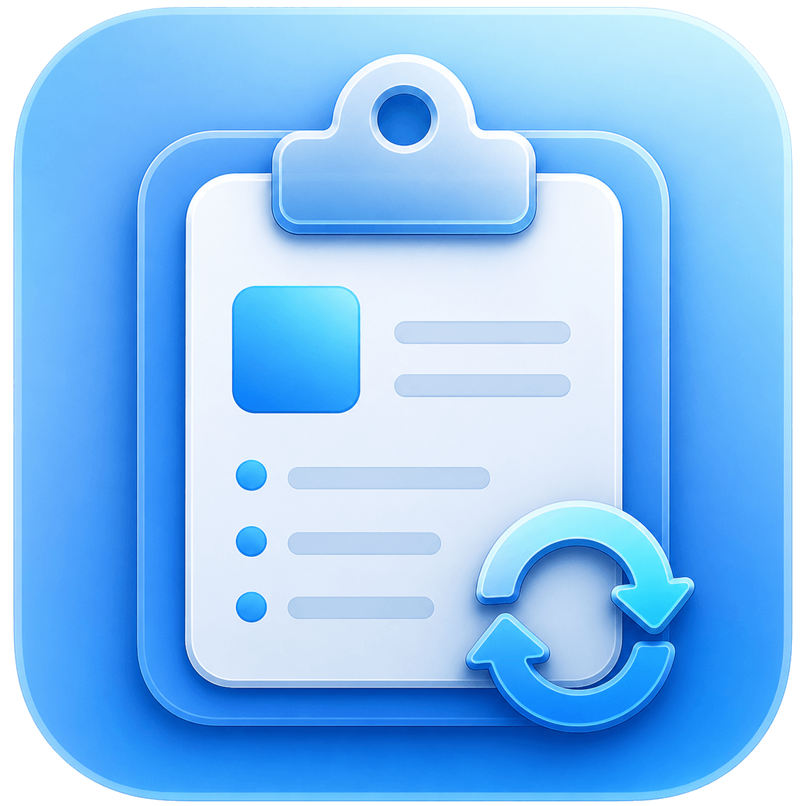

<div align="center">



# 剪驿 ClipBridge

**自托管的跨设备剪贴板同步工具**

_端到端加密 • macOS / Windows • 文本 / 图片 / 文件 / 富文本_

</div>

---

ClipBridge 让你在多台设备之间实时同步剪贴板：在 Mac 上复制，到 Windows 上直接粘贴。

服务端跑在你自己的服务器上，剪贴板内容在设备本地加密后才发出——服务器只负责转发，看不到你复制了什么。

## ✨ 特性

| 能力 | 说明 |
| --- | --- |
| 🔐 **端到端加密** | 内容在设备上加密，服务端无法解密，只能看到「谁发给谁、多大、什么类型」 |
| 🏠 **完全自托管** | 单容器 + SQLite，一条 `docker compose up -d` 跑起来 |
| 📋 **类型丰富** | 文本、图片、单个文件、富文本（RTF / HTML）都能同步 |
| 🖥️ **原生客户端** | macOS 菜单栏 + Windows 托盘应用，安静地待在后台 |
| 🧭 **同步策略** | 可按账号、按设备控制同步类型、大小上限和同步方向 |
| 🧹 **不留历史** | 内容只投递给当前在线的设备，送达即从服务器删除 |
| 🌐 **Web 控制台** | 用户、设备、配对、日志都在浏览器里管理 |

## 🚀 快速开始

### 1. 启动服务端

```bash
mkdir clipbridge && cd clipbridge
curl -fsSLO https://raw.githubusercontent.com/mokeyjay/ClipBridge/main/docker-compose.yml
docker compose up -d
docker compose logs clipbridge
```

> ⚠️ 首次启动的日志里会打印一次性的管理员账号和密码，请立即保存。

启动后有两个入口：

| 入口 | 地址 | 说明 |
| --- | --- | --- |
| Web 控制台 | `http://127.0.0.1:8080` | 默认只绑定本机；公网使用请套 HTTPS 反向代理 |
| 客户端端口 | `https://<服务器>:8443` | 客户端直连，**不要在它前面套反向代理** |

> 客户端通过核对 `8443` 端口的证书指纹来防中间人，代理会替换证书导致所有设备连不上。反向代理配置、备份、升级等细节见 [Docker 部署](./docs/docker.md)。

### 2. 安装客户端

从 [Releases](https://github.com/mokeyjay/ClipBridge/releases) 下载对应压缩包：

| 平台 | 下载文件 |
| --- | --- |
| macOS 13+（Apple Silicon） | `ClipBridge_<version>_macos_arm64.zip` |
| macOS 13+（Intel） | `ClipBridge_<version>_macos_amd64.zip` |
| Windows 10 22H2+ / 11（amd64） | `ClipBridge_<version>_windows_amd64.zip` |

> Windows 10 如果没装过 WebView2 Runtime 需要补一下；Windows 11 已内置。

### 3. 配对设备

1. 用管理员账号登录 Web 控制台，创建一个普通用户
2. 切换到普通用户，在「配对」页生成 6 位配对码
3. 客户端填入 `https://<服务器>:8443` 和配对码，核对并确认证书指纹
4. 回到 Web 控制台批准这个配对请求

每台设备重复一次配对即可。设备同时在线时，复制内容就会自动同步。

## 🧭 常见用法

### 调整同步行为

- 在 Web 控制台设置账号级默认值：允许的类型、大小上限、自动同步阈值等
- 在每台客户端上可以按需覆盖，并选择双向、仅上传或仅下载
- 超过自动同步阈值的内容会弹系统通知让你确认，不会静默传输大文件

### 升级

```bash
# 预发布阶段：先把 docker-compose.yml 中的镜像版本改成新版本号
docker compose pull && docker compose up -d
```

数据库迁移在启动时自动完成。升级前的备份方法见 [Docker 部署](./docs/docker.md#升级)。

### 忘记管理员密码

```bash
docker compose stop clipbridge
docker compose run --rm clipbridge -reset-admin-password
docker compose start clipbridge
```

### 移除设备

在 Web 控制台禁用或吊销设备，它会立即掉线；想重新加入就再走一次配对。

## ⚠️ 使用须知

- ClipBridge 做的是**在线设备间的实时同步**，不是剪贴板历史云盘——复制时对方不在线，这条内容就不会补发
- 文件同步以**单个文件**为单位，多个文件不会自动打包
- 项目目前处于预发布阶段，建议固定镜像版本并定期备份数据卷

## 📚 进阶文档

- [Docker 部署](./docs/docker.md) —— 端口模型、反向代理、数据卷、备份、升级
- [配置参考](./docs/configuration.md) —— 服务端 `config.yaml`、策略层级、客户端配置与文件位置
- [安全模型](./docs/security.md) —— 加密流程、信任建立、服务端能看到什么
- [自行编译](./docs/building.md) —— 工具链、各平台构建与开发脚本
